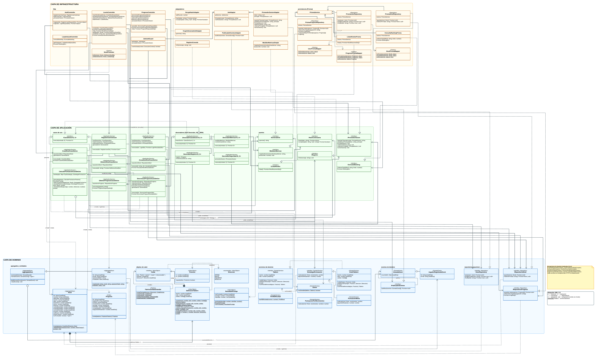

# ArrowMaze Backend

Backend for **ArrowMaze** — a logic puzzle game played on grid boards with continuous-path arrows. The player taps the head of an arrow; if the ray to the board edge is clear, the entire path is removed. The goal is to clear the board.

University project in **Desarrollo de Software** course. **NRC 25783**.
Teacher: Carlos Alonzo

## Development Team — TEAM 01

| Member | ID Number |
|---|---|
| Blanco, Antonio | 20.613.680 |
| Márquez, Jac José | 29.710.631 |
| Fes, Mariana | 30.751.220 |

---

## Stack

- **Runtime:** Node.js + TypeScript
- **HTTP Framework:** [NestJS](https://nestjs.com/) (controllers, guards, interceptors, Swagger at `/api/docs`)
- **Persistence:** [Prisma](https://www.prisma.io/) over PostgreSQL / Supabase
- **Auth:** JWT (Passport) + bcrypt
- **Testing:** Jest (colocated unit tests `*.spec.ts`, e2e in `test/`, coverage gate ≥ 90% on domain + application)

## Architecture: 3-Ring Clean Architecture

The project follows **Clean Architecture** (Robert C. Martin) with a strict dependency rule:

```
   ┌──────────────────────────────────┐
   │        infrastructure/           │  ← NestJS, Prisma, HTTP, JWT, bcrypt
   │  ┌────────────────────────────┐  │
   │  │      application/          │  │  ← Use cases, DTOs, ports, Decorators
   │  │  ┌──────────────────────┐  │  │
   │  │  │      domain/         │  │  │  ← Entities, VOs, Aggregates, Events,
   │  │  │                      │  │  │     Solver, Scoring, Repository ports
   │  │  └──────────────────────┘  │  │
   │  └────────────────────────────┘  │
   └──────────────────────────────────┘

   domain  ←  application  ←  infrastructure
   (imports nothing         (imports only          (imports everything,
    from NestJS/Prisma)      domain)                frameworks allowed)
```

Each ring only knows the one immediately inside it. This is **enforced via ESLint**
(`no-restricted-imports`): the domain layer cannot import `@nestjs/*` or `@prisma/client`;
the application layer cannot import `@prisma/client`. Architecture tests in
`src/shared/__arch__/` validate these rules on every build.

### Layers in detail

| Layer | Responsibility | Conventions |
|---|---|---|
| **`domain/`** | Entities (`User`, `Progreso`), aggregates (`Nivel`), value objects (`Celda`, `Direccion`, `Posicion`, `DefinicionTablero`, `ResultadoPuntaje`), pure services (`Solver`, `GrafoTablero`, scoring strategies), domain exceptions, and **repository ports** (`INivelRepository`, `IUserRepository`, `IProgresoRepository`). | Zero external dependencies. Spanish naming (ubiquitous language). |
| **`application/`** | Use cases (`CrearNivelCasoDeUso`, `RegisterUserUseCase`, `LoginUseCase`, `SincronizarProgresoCasoDeUso`, `CalcularPuntuacionCasoDeUso`, etc.), application DTOs, infrastructure ports (`IHashContrasena`, `IGeneradorId`, `ProveedorSesion`, `IMedidorMetricas`, `IRegistro`), and the **Decorator stack** (security, logging, metrics at the use-case level). | Imports only `domain/`. Decorators implement `ICasoDeUso<E,S>` and depend on ports, never concrete implementations. |
| **`infrastructure/`** | NestJS controllers, Prisma adapters (repositories, mappers, queries), exception → HTTP filters, JWT guards, interceptors (leaderboard cache), security adapters (`BcryptHashAdapter`, `JwtAdapter`), and NestJS modules. | Only layer where NestJS, Prisma, and frameworks are allowed. |




### Implemented GoF Patterns

| Pattern | Where it lives |
|---|---|
| **Strategy** | `EstrategiaPuntuacion` → `PuntuacionPorMovimientos` (untimed levels), `PuntuacionMixta` (timed levels) |
| **Decorator** | Use-case stack: `DecoradorSeguridadCasoDeUso`, `DecoradorRegistroCasoDeUso`, `DecoradorMetricasCasoDeUso` |
| **Observer** | `PublicadorEventosJuego` + `ObservadorJuego` (backend domain events) |
| **Repository** | Ports `INivelRepository`, `IUserRepository`, `IProgresoRepository` → `Prisma*Repository` adapters |
| **Adapter** | All `*Prisma*`, `BcryptHashAdapter`, `JwtAdapter`, `CryptoGeneradorIdAdapter` |
| **Dependency Inversion** | Use cases depend on ports (`IGeneradorId`, `IHashContrasena`, `ProveedorSesion`), not implementations |


## AI-Assisted Development Workflow

This project uses **[OpenCode](https://opencode.ai)** and **[claude code](https://claude.com/code)* as an AI coding agent to maintain architectural consistency across the codebase. The agent is guided by two mechanisms:

### Skills (`.agents/skills/`)

Specialized instructions the agent loads on demand when a task matches a skill's domain. Each skill acts as an expert prompt that ensures the agent follows the right patterns, conventions, and quality gates for that kind of work:

| Skill | Purpose |
|---|---|
| `clean-architecture` | Enforces dependency rules, deep modules, and proper layer boundaries |
| `nestjs-patterns` | NestJS conventions for modules, controllers, DI, guards, interceptors |
| `tdd-strict` | Red → green → refactor cycle; tests target deep-module interfaces |
| `conventional-commits` | Generates commit messages following Conventional Commits standard |
| `grill-with-docs` | Stress-tests plans against the domain model and updates ADRs/CONTEXT.md |
| `ai-usage-doc` | Maintains `AI_USAGE.md` documenting AI tool usage |
| `handoff` | Compacts the current conversation into a handoff document for another agent |
| `teach` | Teaches new skills or concepts within the workspace |
| `write-a-skill` | Creates new agent skills with proper structure |
| `zoom-out` | Provides broader context on code sections and how they fit the bigger picture |

### Project Instructions (`AGENTS.md`)

The central convention file that the agent reads automatically at the start of every session. It contains the quick-start commands, architecture overview, DI wiring gotchas, Prisma mapper conventions, testing patterns, scoring strategy, naming conventions, and the delivery DAG reference.

### Typical workflow cycle

1. The agent reads `AGENTS.md` for project-wide conventions.
2. When a task is scoped (e.g. a new use case), the matched skill is loaded (e.g. `tdd-strict` + `clean-architecture`).
3. The agent follows TDD (write failing test → implement → refactor), respects layer boundaries, and uses ubiquitous language.
4. Commits follow conventional commit format, generated via the `conventional-commits` skill.

This workflow was inspired by the AI coding patterns demonstrated by:

- **[AI Engineer](https://www.youtube.com/@aiDotEngineer)** — host of the walkthrough where Matt Pocock detailed agent-based workflows for consistent project development.
- **[Matt Pocock](https://www.youtube.com/@mattpocockuk)** — TypeScript educator whose "Full Walkthrough: Workflow for AI Coding" ([video](https://www.youtube.com/watch?v=-QFHIoCo-Ko)) demonstrates how structured agent instructions and skills drive repeatable, high-quality AI-assisted development.

## Project Structure

```
src/
├── domain/
│   ├── aggregates/          # Nivel (aggregate root)
│   ├── entities/            # User, Progreso
│   ├── events/              # Domain events + IPublicadorEventos
│   ├── exceptions/          # Domain exceptions (8 classes)
│   ├── repositories/        # Ports: INivelRepository, IUserRepository, IProgresoRepository
│   ├── services/            # Solver, GrafoTablero, PerfilDificultad, scoring strategies
│   ├── stereotypes/         # AggregateRoot, DomainEvent (base classes)
│   └── value-objects/       # Celda, Direccion, Posicion, DefinicionTablero, ResultadoPuntaje
├── application/
│   ├── decorators/          # DecoradorCasoDeUso + 3 concrete decorators
│   ├── dtos/                # Application DTOs (9 classes)
│   ├── ports/               # Ports: IHashContrasena, IGeneradorId, ProveedorSesion, etc.
│   ├── queries/             # IListarNiveles (CQRS-lite read side)
│   └── use-cases/           # 8 use cases with their specs
├── infrastructure/
│   ├── adapters/
│   │   ├── http/            # Controllers (4), HTTP DTOs, exception filters (7), guards, interceptors, presenters
│   │   ├── identity/        # CryptoGeneradorIdAdapter
│   │   ├── logging/         # RegistroConsola
│   │   ├── messaging/       # PublicadorEventosAdapter
│   │   ├── metrics/         # MedidorMetricasSimple
│   │   ├── persistence/     # PrismaService, repos, mappers, queries (leaderboard, list levels)
│   │   └── security/        # BcryptHashAdapter, JwtAdapter, ProveedorSesionAdapter
│   └── modules/             # NestJS modules (auth, levels, progress, leaderboard, identity)
└── shared/
    ├── __arch__/            # Architecture tests (domain purity, forbidden imports, ubiquitous language)
    ├── __fixtures__/        # Golden boards and golden scores (shared with Dart frontend)
    ├── constants/
    └── utils/
```

## HTTP Endpoints

| Method | Route | Description |
|---|---|---|
| `POST` | `/auth/register` | Player registration |
| `POST` | `/auth/login` | Login + JWT |
| `POST` | `/levels` | Create level (authoring, solvability-gated) |
| `GET` | `/levels` | List level catalog |
| `GET` | `/levels/:id` | Get level by ID (re-validates solvability) |
| `PUT` | `/levels/:id` | Update level (re-gated) |
| `POST` | `/progress/sync` | Sync progress (batch, upsert-best) |
| `GET` | `/progress` | Get authenticated player's progress |
| `GET` | `/leaderboard` | Score leaderboard (TTL-cached) |

Interactive Swagger available at `/api/docs` when running `npm run start:dev`.

## Quick Start

```bash
cp .env.example .env          # set DATABASE_URL (PostgreSQL / Supabase)
npm install
npx prisma generate
npm run start:dev             # server at http://localhost:3000, Swagger at /api/docs
```

## Commands

| Command | Description |
|---|---|
| `npm run build` | NestJS compilation → `dist/` |
| `npm run start:dev` | `prisma generate` + dev server with watch |
| `npm run test` | Unit tests (Jest, colocated) |
| `npm run test:cov` | Tests + coverage (gate: domain + application ≥ 90%) |
| `npm run test:e2e` | End-to-end tests (`test/`) |
| `npm run lint` | ESLint + Prettier (auto-fix) |
| `npm run format` | Prettier manual |
| `npm run seed` | Run database seed |

## License

UNLICENSED — private project.